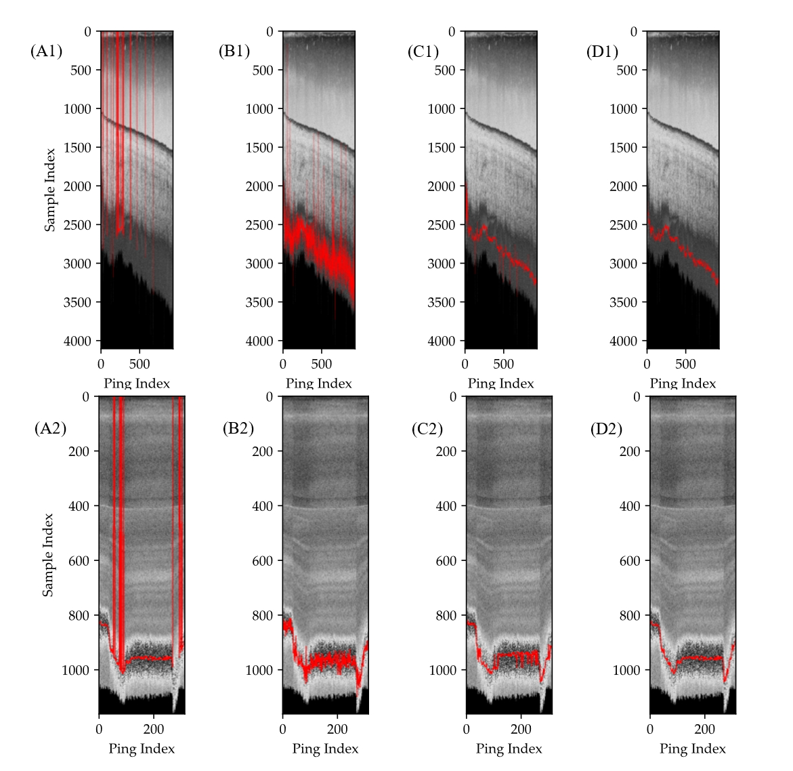

# Bottom-re-detection-of-multibeam-echosounders-at-high-incidence-angles

## What is this repository for?

Data and codes for the manuscript "Bottom re-detection of multibeam echosounders at high incidence angles based on water column data and self-attention network"

## Main Codes and Files

MBESSample60.zip: samples for model training and validation.
- source: The extracted echo strength sequeces of varouise lengths.
- label: The manual bottom detection postion in the corresponding source sequece.

EMAllParser.py：codes for decoding the raw multibeam binary file.

WCP.py: codes for generating along-track multibeam images and one beam echo sequences.

models.py: codes for the proposed model.

tools.py: codes for model comparison.

overall_flow.ipynb: jupyter notebook which shows the overall flow of the proposed method.

## Multibeam files 

Due to the limitation of upload file size, only 2 small raw multibeam files were uploaded. More multibeam files can be accessed at the [NOAA website](https://www.ncei.noaa.gov/maps/water-column-sonar/). 

## Usage and Examples

Just follow the jupyter notebook "overall_flow.ipynb".

The jupyter notebook containes steps of how to read the sample set, how to train the model, and how to test the model. 

The jupyter notebook containes 3 examples of applying the trained model to process 3 different multibeam binary files. The results were also within the notebook.

If you want to train the model, you need to unzip the MBESSample60.zip and ensure proper path.

If you want to test the model, you need to unzip the multibeam 7z files, or download at the [NOAA website](https://www.ncei.noaa.gov/maps/water-column-sonar/) and ensure proper path.

## Who do I talk to?

Jun Yan, Anhui University 

jun.yan@ahu.edu.cn

## License

This program is free software under the terms of the Apache-2.0 license.
