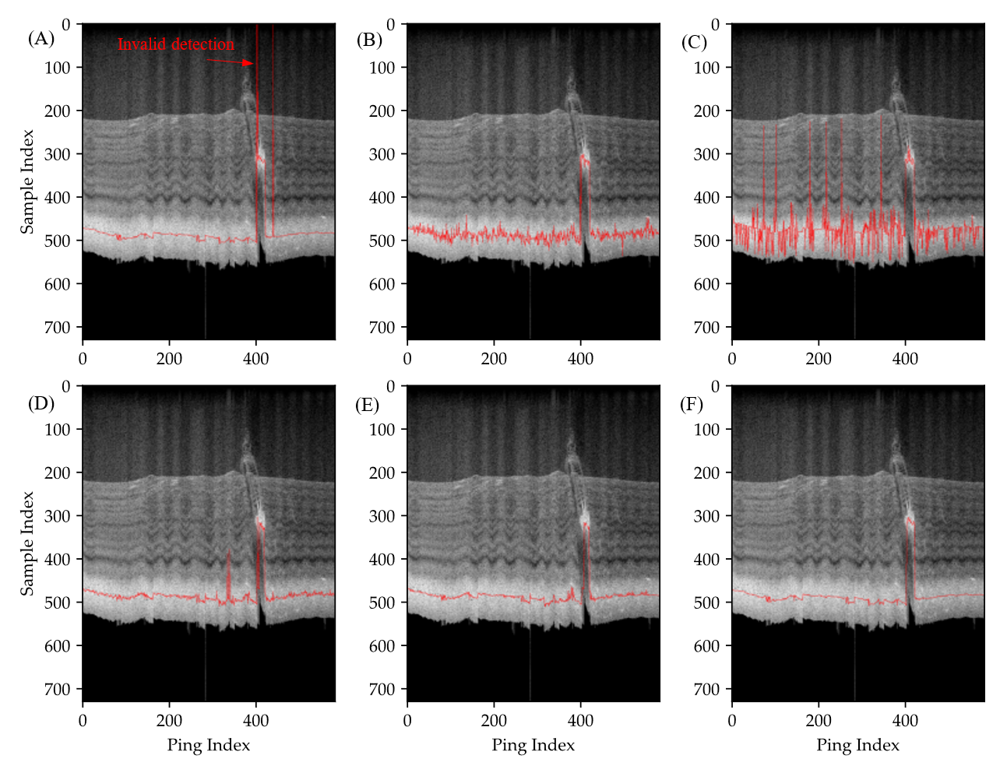

# Bottom-re-detection-of-multibeam-echosounders-at-high-incidence-angles

Data and codes for the manuscript "Bottom re-detection of multibeam echosounders at high incidence angles based on water column data and self-attention network"

Due to the limitation of upload file size, only small raw multibeam files were uploaded with the code.  multibeam files 

## Code Files.

MBESSample60_.zip: samples for model training and validation.
- source: The extracted echo strength sequece with varouise length
- label: The manual bottom detection postion in the corresponding source sequece

EMAllParser.py：codes for decoding the raw multibeam binary file.

WCP.py: codes for generating along-track multibeam images and one beam echo sequece.

models.py: codes for the model.

tools.py: codes for model comparison.
